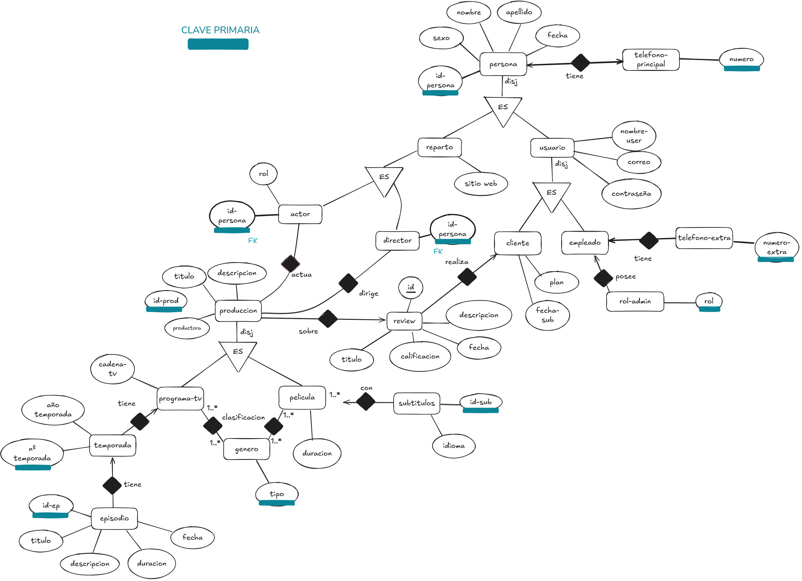

Por lo que parece el ejercicio es mas una practica de modelarlo con un diagrama Entidad-Relacion. El pasaje a tablas desde el diagrama si bien no es trivial, las consultas sobre los datos que se piden seria de la siguiente manera:

- Listar los datos de los clientes suscritos al plan PREMIUM con una determinada fecha de suscripcion

```
SELECT c.* 
FROM cliente c 
WHERE c.plan="PREMIUM" 
AND c.fecha-sub < X
```

- Listar los datos de las peliculas donde el actor 'X' fue protagonista

```
SELECT p.* 
FROM produccion p 
JOIN pelicula pe ON p.id = pe.id
JOIN actor a ON a.id-persona = p.id
WHERE a.nombre = 'X'
AND a.rol = "protagonista"
```

- Las otras consultas quedan como ejercicio al lector ;)


